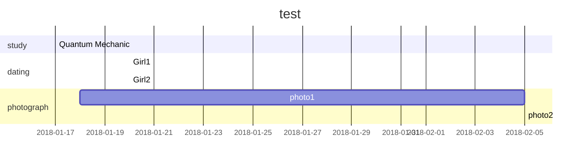

# Markdown Graph

```flow
st=>start: Start
op=>operation: Choose
cd=>condition: yes/no
e=>end
st->op->cd
cd(yes)->e
cd(no)->op
```

```sequence
participant A
participant B
participant C
A->B: step 1
B->B: step 2
note right of A: note1
note left of B: note2
A-->C:step 3
B-->>C:step 4
C->A: over
```



